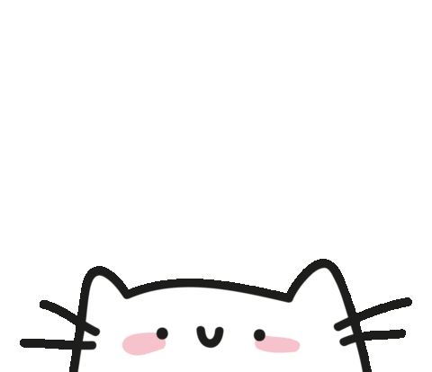

# Hello there! 👋🻠I am Kirk Lin! 

关于我 (About Me) 🇨🇳

我一直不希望自己只是一个写代码的程序员。对我来说，编程是一种创造的艺术，是表达思想的媒介，更是改变世界的工具。我追求的是将技术、设计和人文完美融合，创造出既功能强大又富有美感和人性化的产品。

我对精美界面和极致用户体验的追求源于对美和完美的本能向往。每当我设计一个界面，我都在思考：如何让每个元素都恰到好处，如何让用户在使用时感到愉悦和满足？这种追求是我对这个世界的理解和诠释的体现。

但我的视野并不局限于技术领域。我深信跨学科思维的力量。经济学、心理学、哲学，甚至艺术和文学，这些看似与编程无关的学科，都在我的思维模型中占有重要位置。这种跨界思考让我能够跳出“拿着锤子，看啥都像钉子”的思维陷阱，以更全面、更深入的视角来解决问题。

摄影和人文是我表达创意和理解世界的重要方式。通过镜头，我捕捉生活中转瞬即逝的美；通过阅读和思考，我深入理解人性和社会。这些经历丰富了我的视角，让我在创造数字产品时能够融入更多人文关怀和美学考量。

我始终相信，真正伟大的技术应该是无形的，它应该自然地融入人们的生活，提升生活质量，而不是成为一种负担。这就是为什么我无时无刻不在思考如何改变世界。对我来说，改变世界不是一句空洞的口号，而是实实在在的行动。每一个精心设计的界面，每一个流畅的用户体验，每一个解决实际问题的功能，都是我改变世界的尝试。

我对细节的执着，对完美的追求，有时会被理解为偏执。但我坚信，正是这种近乎偏执的专注，才能创造出真正卓越的产品。我常说：** “完美是一个过程，而不是一个终点。当你觉得满意时，就是你停止进步的时候。” **保持创新至关重要。但对我来说，创新不仅仅是学习新的编程语言或框架。真正的创新是打破界限，是将技术与设计、与人文思考相结合，创造出能够真正改善人们生活的产品。

我的动力来自哪里？它来自于看到用户因为我设计的产品而感到生活变得更美好的那一刻，来自于通过技术解决实际问题时的成就感，来自于对创造更美好世界的坚定信念。

有人可能会说我的想法太过理想化，改变世界听起来可能有些狂妄与中二。但我始终相信，正是这种看似不切实际的理想主义，才是推动技术和社会进步的真正动力。** “理想主义者在绝望中看到机会，在黑暗中创造光明。我们不是生活在世界上，而是创造着这个世界。” **如果我们不怀着改变世界的雄心壮志去工作，那么我们又怎能创造出真正伟大的作品呢？

这就是我，**Kirk Lin**，一个始终追求在代码中注入艺术灵魂和人文关怀的工程师。我相信，通过不懈的努力、持续的创新和跨学科的思考，我们终将创造出不仅功能强大，而且美观、人性化，真正能够改变世界的产品。这不仅是我的工作，更是我的使命和热忱所在。在这个过程中，我将始终铭记：完美是永无止境的追求，而创造一个更美好的世界，正是我们每个人的责任与机遇。

About Me 🇬🇧

<samp>
<b>I've always aspired to be more than just a code-writing programmer. To me, programming is an art of creation, a medium for expressing ideas, and a tool for changing the world. My pursuit is to perfectly integrate technology, design, and humanities to create products that are not only powerful but also aesthetically pleasing and user-friendly.</b>
</samp>

<samp>
<b>My quest for beautiful interfaces and ultimate user experiences stems from an innate desire for beauty and perfection. Whenever I design an interface, I ponder: How can each element be just right? How can I make users feel joy and satisfaction when using it? This pursuit reflects my understanding and interpretation of the world.</b>
</samp>
 
<samp>
<b>However, my vision is not limited to the technological realm. I firmly believe in the power of interdisciplinary thinking. Economics, psychology, philosophy, even art and literature - these disciplines seemingly unrelated to programming all hold important positions in my thinking model. This cross-disciplinary thinking allows me to avoid the "if all you have is a hammer, everything looks like a nail" trap, enabling me to solve problems with a more comprehensive and in-depth perspective.</b>
</samp>
 
<samp>
<b>Photography and humanities are important ways for me to express creativity and understand the world. Through the lens, I capture fleeting moments of beauty in life; through reading and reflection, I gain a deeper understanding of human nature and society. These experiences enrich my perspective, allowing me to incorporate more humanistic care and aesthetic considerations when creating digital products.</b>
</samp>
 
<samp>
<b>I've always believed that truly great technology should be invisible, naturally integrating into people's lives to improve quality of life, rather than becoming a burden. That's why I'm constantly thinking about how to change the world. For me, changing the world isn't an empty slogan, but concrete action. Every carefully designed interface, every smooth user experience, every function that solves real problems - these are all my attempts to change the world.</b>
</samp>
 
<samp>
<b>My obsession with details and pursuit of perfection might sometimes be seen as stubborn. But I firmly believe that it's this near-obsessive focus that creates truly outstanding products. As I often say: "Perfection is a process, not an endpoint. When you feel satisfied, that's when you stop progressing." Innovation is crucial. But for me, innovation isn't just about learning new programming languages or frameworks. True innovation is about breaking boundaries, combining technology with design and humanistic thinking to create products that can truly improve people's lives.</b>
</samp>
 
<samp>
<b>Where does my motivation come from? It comes from seeing users' lives improve because of the products I design, from the sense of achievement when solving real problems through technology, and from the firm belief in creating a better world.</b>
</samp>
 
<samp>
<b>Some might say my ideas are too idealistic, that changing the world sounds somewhat arrogant and naive. But I've always believed that it's this seemingly impractical idealism that is the real driving force behind technological and social progress. "Idealists see opportunities in despair and create light in darkness. We don't just live in the world, we create it." If we don't work with the ambition to change the world, how can we create truly great works?</b>
</samp>
 
<samp>
<b>This is who I am, Kirk Lin, an engineer who always strives to inject artistic soul and humanistic care into code. I believe that through relentless effort, continuous innovation, and interdisciplinary thinking, we will eventually create products that are not only powerful but also beautiful, user-friendly, and truly capable of changing the world. This is not just my work, but my mission and passion. In this process, I will always remember: the pursuit of perfection is endless, and creating a better world is both our responsibility and opportunity.</b>
</samp>

## Contact Me

- 💼 Looking for freelance work? Reach out!
- 💬 Ask me anything, I'm happy to help!
- 💼 有自由职业工作需求或者兼职请随时联系我 :)
- 💬 有任何问题，请随时向我提问，我乐意帮助

## Skills

**Languages and Tools:**

<code></code>
<code></code>
<code></code>
<code></code>
<code></code>
<code></code>
<code></code>
<code></code>
<code></code>

## Support My Work

If you like what I do, consider buying me a book 🥺

如果您喜欢我的工作，也许可以考虑给我买一本书 🥺

